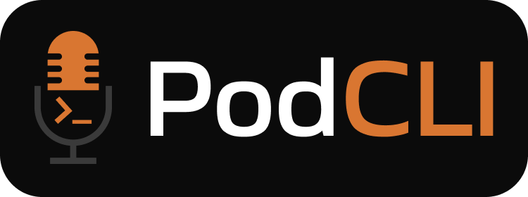

<p align="center">
  
</p>

<p align="center">
  <strong>Open-source AI podcast clipper.</strong><br/>
  Turn a long episode into short clips with face tracking and burned-in captions. Drive it from the CLI, a web studio, or your coding agent.
</p>

<p align="center">
  <a href="https://podcli.com"><strong>podcli.com</strong></a> ·
  <a href="https://podcli.com/docs">Docs</a> ·
  <a href="#install">Install</a> ·
  <a href="#use-it-from-your-agent">MCP</a>
</p>

<p align="center">
  <a href="https://github.com/nmbrthirteen/podcli/blob/main/LICENSE"></a>
  <a href="https://github.com/nmbrthirteen/podcli/stargazers"></a>
</p>

<p align="center">
  <a href="https://x.com/nikasiradze_/status/2056061654664708570">
    
  </a>
</p>
<p align="center"><sub>▶ <a href="https://x.com/nikasiradze_/status/2056061654664708570">Watch with sound on X</a></sub></p>

```bash
podcli process episode.mp4
```

That one command transcribes the episode, picks the moments worth clipping, crops to whoever is speaking, and burns the captions in. Transcription and rendering run on your machine. The only network calls are the optional Claude or Codex requests when you use AI clip scoring.

## Install

No prerequisites. The installer fetches a self-contained binary, and the first run provisions Python, Node, FFmpeg, whisper.cpp, and the models it needs into a managed folder.

**macOS and Linux**

```bash
curl -fsSL https://podcli.com/install.sh | sh
```

**Windows (PowerShell)**

```powershell
irm https://podcli.com/install.ps1 | iex
```

Runs on macOS (Apple Silicon), Linux (x64 and arm64), and Windows (x64). Intel Mac support is in progress.

## Quick start

```bash
podcli                       # interactive menu, opens the web studio
podcli process episode.mp4   # transcribe, pick moments, render clips
```

Clips land in `podcli-clips/` in the directory you ran it from, so each show keeps its own renders. Everything else (knowledge, presets, assets, clip history, cache) lives in one managed folder that follows you between directories. Set `PODCLI_OUTPUT` to render somewhere fixed instead.

## What you get

**Clips**

- 9:16, 16:9, or 1:1, with captions sized for each canvas
- Face tracking that follows the speaker, split-screen layouts included
- Multi-segment cuts that drop filler, long pauses, and tangents
- Four caption styles: branded, hormozi, karaoke, subtle
- Logos, intros, outros, and background music from a reusable asset library
- Loudness-normalized audio and hardware encoding on VideoToolbox, NVENC, and VAAPI, with a CPU fallback

**Finding the moments**

- Whisper transcription with speaker diarization, or bring your own transcript as `.txt`, `.srt`, or `.vtt`
- AssemblyAI as an alternative engine, and yt-dlp to pull an episode straight from a URL
- AI scoring against your knowledge base, checked against your episode database so it stops resuggesting moments you already published
- Audio energy and laughter detection to build highlight reels

**The studio at `localhost:3847`**

- Library, episode workspace, per-clip detail, highlights, thumbnails, content, analytics, assets, knowledge, config, integrations, and MCP setup
- `⌘K` command palette across pages, clips, and assets
- Titles, descriptions, tags, and hashtags, with any section regenerated on your own guidance
- Thumbnail studio for 16:9 and 9:16, with frame and text options
- Transcript corrections that carry through to every render

**Shipping it**

- 26 MCP tools, so an agent can transcribe, score, render, and publish through conversation
- YouTube publishing plus performance analytics to see which clips landed
- DaVinci Resolve export as FCPXML when you want to finish by hand
- Presets, clip history with duplicate detection, and a transcript cache

## Why podcli

If you are weighing podcli against the cloud clippers, this is the difference:

- Runs locally. Transcription and rendering happen on your machine, so episodes never upload.
- Free and open source under AGPL-3.0. Exports are unlimited, full quality, and watermark-free.
- Agent-native. 26 MCP tools let Claude Code or Codex drive the whole flow, transcription through publishing.
- A knowledge base keeps titles, captions, and descriptions in your show's voice, and stops the engine from resuggesting moments you already published.
- DaVinci Resolve handoff. Export any clip as FCPXML when you want to finish the edit yourself.

## Use it from your agent

podcli is an [MCP](https://modelcontextprotocol.io) server, so an agent can transcribe, suggest clips, and render them through conversation.

```bash
podcli mcp install    # registers it with Claude Code
```

Claude Desktop and Codex setup is in the [MCP docs](https://podcli.com/docs/mcp-server).

## Content workflow

[PodStack](https://github.com/nmbrthirteen/podstack) ships with podcli as a set of Claude Code slash commands. They take a transcript to a publish-ready package: scored moments, titles, descriptions, thumbnail briefs, a brand review, and a publish checklist.

```
/produce-shorts
```

The commands live in `.claude/commands/`. [CLAUDE.md](CLAUDE.md) describes each one.

## Docs

| Guide | What's in it |
| ----- | ------------ |
| [Getting started](https://podcli.com/docs) | Install, first episode, the whole flow |
| [The studio](https://podcli.com/docs/the-studio) | Web UI: library, episodes, content, highlights |
| [CLI](https://podcli.com/docs/cli) | Commands, flags, presets, assets |
| [MCP server](https://podcli.com/docs/mcp-server) | Agent setup and available tools |
| [Captions and formats](https://podcli.com/docs/captions-and-formats) | Styles, aspect ratios, cropping |
| [Configuration](docs/configuration.md) | Environment variables, config profiles, transcript format |

Docs are open source at [nmbrthirteen/podcli-docs](https://github.com/nmbrthirteen/podcli-docs).

## Contributing

See [CONTRIBUTING.md](CONTRIBUTING.md) for the dev setup and conventions, and [RELEASE.md](RELEASE.md) for how releases are cut.

## Credits

Content workflow powered by [PodStack](https://github.com/nmbrthirteen/podstack), inspired by [gstack](https://github.com/garrytan/gstack) by Garry Tan.

## License

AGPL-3.0. See [LICENSE](LICENSE).

Need podcli without AGPL terms? A commercial license is available. Email [siradze@nikusha.me](mailto:siradze@nikusha.me) with a one-line description of your use case.
